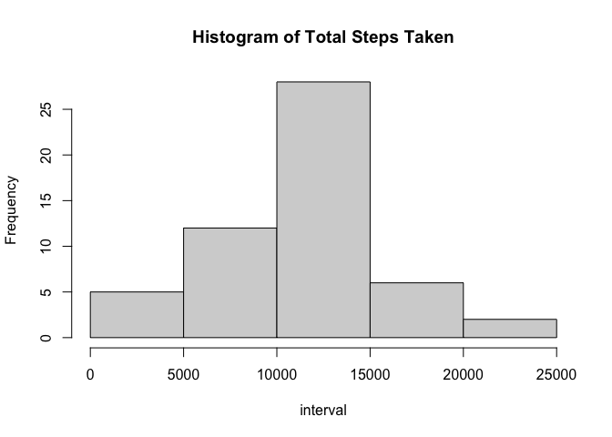
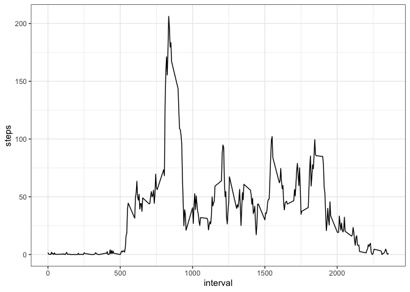
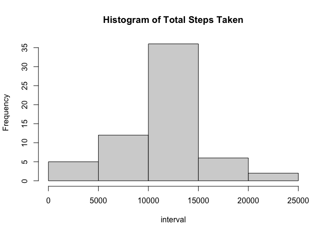
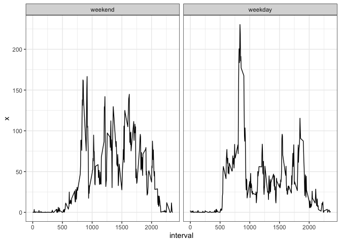

## Introduction ##
In this project, we are going to analyze the data collected from a personal activity monitoring device. This device collects data at 5 minute intervals through out the day. The data consists of two months of data from an anonymous individual collected during the months of October and November, 2012 and include the number of steps taken in 5 minute intervals each day. 

Our goal is to answer the following quesions:  
- What is mean of the total number of steps taken per day?  
- What is the average daily activity pattern?  
- How to impute missing values?  
- Are there differences in activity patterns between weekdays and weekends?

In order to answer these questions, data modification and plotting will be performed to help us find the pattern. 

## Loading and preprocessing the data ##
First, check if the data file exists in the current working directory. If not, download the file and load it into R. 


```r
if(!file.exists("activity.csv")){download.file("https://d396qusza40orc.cloudfront.net/repdata%2Fdata%2Factivity.zip", destifile <- "data.zip", method = "curl")}
unzip("data.zip")
df <- read.csv("activity.csv")
str(df)
```

```
## 'data.frame':	17568 obs. of  3 variables:
##  $ steps   : int  NA NA NA NA NA NA NA NA NA NA ...
##  $ date    : chr  "2012-10-01" "2012-10-01" "2012-10-01" "2012-10-01" ...
##  $ interval: int  0 5 10 15 20 25 30 35 40 45 ...
```

Then we'll set the correct data type for variable "date"


```r
df$date <- as.Date(df$date)
str(df)
```

```
## 'data.frame':	17568 obs. of  3 variables:
##  $ steps   : int  NA NA NA NA NA NA NA NA NA NA ...
##  $ date    : Date, format: "2012-10-01" "2012-10-01" "2012-10-01" "2012-10-01" ...
##  $ interval: int  0 5 10 15 20 25 30 35 40 45 ...
```

## What is the mean of total number of steps taken per day?
We'll calculate the sum of steps for each day, make a histogram of the data for better visualizaion, and call the summary() function to see the mean and median for this data set.


```r
step.sum <- aggregate(df$steps, by=list(date = df$date), FUN=sum)
names(step.sum) <- c("date", "steps")
head(step.sum)
```

```
##         date steps
## 1 2012-10-01    NA
## 2 2012-10-02   126
## 3 2012-10-03 11352
## 4 2012-10-04 12116
## 5 2012-10-05 13294
## 6 2012-10-06 15420
```

```r
hist(step.sum$steps, xlab = "interval", main = "Histogram of Total Steps Taken")
```

<!-- -->

```r
summary(step.sum$steps)
```

```
##    Min. 1st Qu.  Median    Mean 3rd Qu.    Max.    NA's 
##      41    8841   10765   10766   13294   21194       8
```

## What is the average daily activity pattern?

We will calculate the average steps taken within 5-minute interval across all days, we then will make a time series plot of the 5-minute interval (x-axis) and the average number of steps taken, averaged across all days (y-axis)

```r
library(dplyr)
int.ave <- aggregate(df$steps, by=list(interval = df$interval), FUN=mean, na.rm = TRUE)
int.ave <- rename(int.ave, steps = x)
head(int.ave)
```

```
##   interval     steps
## 1        0 1.7169811
## 2        5 0.3396226
## 3       10 0.1320755
## 4       15 0.1509434
## 5       20 0.0754717
## 6       25 2.0943396
```

```r
library(ggplot2)
ggplot(data = int.ave, aes(x = interval, y = steps, group = 1)) +
        geom_line() + 
        theme_bw()
```

<!-- -->


We also needed to see which interval across the day has the highest average of steps taken. 


```r
int.ave[which.max(int.ave$steps), ]
```

```
##     interval    steps
## 104      835 206.1698
```

## Imputing missing values

In this part we will first look at how many NAs are in this data set. Then we will replace these NAs with the mean of steps in that particular interval, which we have already calculated in the previous part 

```r
table(is.na(df$steps))
```

```
## 
## FALSE  TRUE 
## 15264  2304
```

```r
df.na<- df[is.na(df), ]
table(df.na$date)
```

```
## 
## 2012-10-01 2012-10-08 2012-11-01 2012-11-04 2012-11-09 2012-11-10 2012-11-14 2012-11-30 
##        288        288        288        288        288        288        288        288
```

From the result above we can see that there are 2304 NA values in this data set, and there are 8 days where the whole data sets are missing. So we can replace those NAs with the mean of steps for each interval across the whole data set. 


```r
fill <- rep(int.ave$steps, 8)
df2 <- data.frame(steps = df$steps, date = df$date, interval = df$interval)
df2[is.na(df2), "steps"] <- fill
table(is.na(df2))
```

```
## 
## FALSE 
## 52704
```

```r
step.sum2 <- aggregate(df2$steps, by=list(date = df2$date), FUN=sum, na.rm = TRUE)
names(step.sum2) <- c("date", "steps")
hist(step.sum2$steps, xlab = "interval", main = "Histogram of Total Steps Taken")
```

<!-- -->

```r
summary(step.sum2$steps)
```

```
##    Min. 1st Qu.  Median    Mean 3rd Qu.    Max. 
##      41    9819   10766   10766   12811   21194
```

From the ouput we can see that the mean remains the same after imputing missing values, and the median increased by 1 step. The impact of imputing missing data on the estimates of the total daily number of steps is relatively small. 

## Are there differences in activity patterns between weekdays and weekends?

In this part, we will add another variable "wDay" which has two levels: weekday and weekend. We'll also make a panel plot containing a time series plot of the 5-minute interval (x-axis) and the average number of steps taken, averaged across all weekday days or weekend days (y-axis)


```r
weekdays1 <- c('Monday', 'Tuesday', 'Wednesday', 'Thursday', 'Friday')
df2$wDay <- factor((weekdays(df2$date) %in% weekdays1), 
                   levels=c(FALSE, TRUE), labels=c('weekend', 'weekday'))
head(df2)
```

```
##       steps       date interval    wDay
## 1 1.7169811 2012-10-01        0 weekday
## 2 0.3396226 2012-10-01        5 weekday
## 3 0.1320755 2012-10-01       10 weekday
## 4 0.1509434 2012-10-01       15 weekday
## 5 0.0754717 2012-10-01       20 weekday
## 6 2.0943396 2012-10-01       25 weekday
```

```r
ave.final <- aggregate(df2$steps, by=list(interval = df2$interval, wDay = df2$wDay), FUN=mean)
library(ggplot2)
ggplot(data = ave.final, aes(x = interval, y = x, group = 1)) +
        geom_line() +
        facet_grid(.~ wDay) + 
        theme_bw()
```

<!-- -->

By observing the graph patterns above, we can see that there's a noticeable difference betweeen these 2 groups. The overall shape of weekend group is smoother than weekday group, meaning the data is more evenly distributed. In the weekday group, we can see a huge spike around 8:30 am; the value remain lower than weekday and steady from 10:00 am to 5 pm. 
